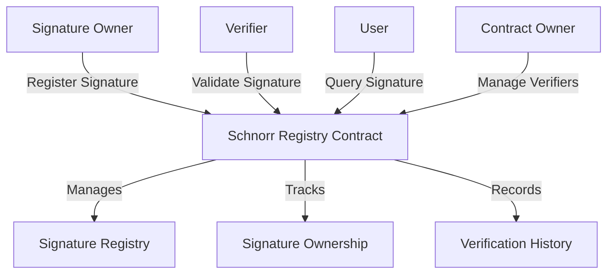

# Evolutionary Schnorr: Decentralized Signature Registry

A secure, blockchain-native system for managing and verifying Schnorr signatures with robust identity and cryptographic integrity.

## Overview

Evolutionary Schnorr provides a decentralized platform for registering, managing, and validating Schnorr signatures on the Stacks blockchain. The system enables:

- Secure signature registration
- Decentralized identity verification
- Cryptographic signature management
- Transparent signature history tracking
- Flexible identity validation mechanisms
- Robust access control and governance

## Architecture

The system leverages a core smart contract to manage Schnorr signature registration and verification.



### Core Components

1. **Signature Registry**: Stores registered Schnorr signatures
2. **Verification System**: Manages signature validation
3. **Ownership Tracking**: Handles signature ownership
4. **History Management**: Maintains signature verification records
5. **Access Control**: Ensures secure and controlled interactions

## Contract Documentation

### Main Contract: schnorr-registry.clar

Manages Schnorr signature registration and verification mechanisms:

#### Key Features

- Secure signature registration
- Identity verification infrastructure
- Decentralized signature management
- Comprehensive signature tracking
- Flexible verification protocols

#### Access Control

- Contract Owner: Manages system parameters
- Signature Owners: Register and manage signatures
- Verifiers: Validate registered signatures
- Users: Query and verify signatures

## Getting Started

### Prerequisites

- Clarinet
- Stacks wallet
- Basic understanding of Schnorr signatures

### Basic Usage

1. **Register a Signature**:
```clarity
(contract-call? .schnorr-registry register-signature 
    public-key 
    signature-data 
    metadata)
```

2. **Verify a Signature**:
```clarity
(contract-call? .schnorr-registry verify-signature signature-id)
```

3. **Transfer Signature Ownership**:
```clarity
(contract-call? .schnorr-registry transfer-signature signature-id recipient)
```

## Function Reference

### Signature Management

```clarity
(register-signature public-key signature-data metadata)
(update-signature-metadata signature-id new-metadata)
(retire-signature signature-id)
```

### Verification Functions

```clarity
(verify-signature signature-id)
(validate-public-key public-key)
(check-signature-status signature-id)
```

### Ownership Management

```clarity
(transfer-signature signature-id recipient)
(update-signature-ownership signature-id)
```

## Development

### Testing

1. Clone the repository
2. Install Clarinet
3. Run tests:
```bash
clarinet test
```

### Local Development

1. Start Clarinet console:
```bash
clarinet console
```

2. Deploy contract:
```bash
clarinet deploy
```

## Security Considerations

### Signature Verification
- Cryptographically secure signature validation
- Immutable verification records
- Strict ownership controls

### Identity Protection
- Decentralized signature management
- Transparent ownership tracking
- Prevention of signature spoofing

### System Limitations
- Signature size and complexity constraints
- Verification time complexity
- No direct personal data storage
- Governance-based verification model